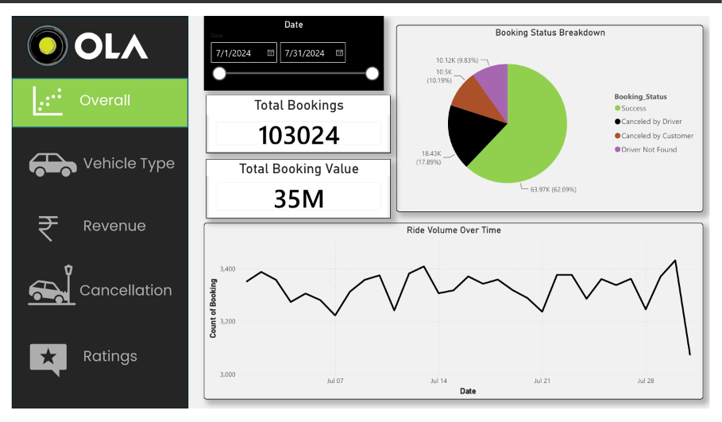

# Ola Analytics Dashboard

> An interactive business intelligence dashboard for analyzing Ola ride-booking data, customer behavior, revenue, cancellations, and operational performance.

## Overview

The **Ola Analytics Dashboard** is a data analytics and visualization project designed to transform raw ride-booking data into meaningful business insights.

The dashboard provides stakeholders with a centralized view of key business metrics, helping identify **revenue trends, booking patterns, cancellation behavior, customer preferences, and vehicle performance**.

The project focuses on answering practical business questions through data-driven analysis and interactive visualizations.

## Business Objectives

The dashboard was developed to answer questions such as:

- How are total bookings and revenue performing?
- Which vehicle categories generate the most revenue?
- What are the major reasons for ride cancellations?
- How does customer behavior vary across ride categories?
- Which payment methods are most frequently used?
- What factors affect successful bookings?
- Where are operational bottlenecks occurring?
- How can Ola improve customer experience and operational efficiency?

## Key KPIs

| KPI | Description |
|---|---|
| Total Bookings | Overall number of ride bookings |
| Total Revenue | Revenue generated from completed rides |
| Average Booking Value | Average revenue generated per booking |
| Cancellation Rate | Percentage of cancelled bookings |
| Customer Ratings | Indicator of customer experience |
| Vehicle Performance | Performance across different vehicle categories |
| Payment Analysis | Distribution of payment methods |

## Key Analysis Areas

### 1. Booking Analysis

Analyze booking volumes and identify trends across different ride categories and time periods.

### 2. Revenue Analysis

Evaluate revenue contribution across vehicle types, customer segments, and booking categories.

### 3. Cancellation Analysis

Identify cancellation patterns and understand the major reasons behind unsuccessful rides.

### 4. Customer Analysis

Analyze customer preferences, booking behavior, ratings, and payment patterns.

### 5. Vehicle Performance

Compare vehicle categories based on bookings, revenue, ratings, and operational metrics.

### 6. Operational Insights

Identify patterns that can help improve driver utilization, reduce cancellations, and enhance overall service efficiency.

## Tech Stack

- **Data Analysis:** Python, Pandas, NumPy
- **Database & Querying:** SQL
- **Data Visualization:** Power BI
- **Data Processing:** Pandas, NumPy
- **Version Control:** Git & GitHub

## Project Workflow

```text
Raw Ride Data
      ↓
Data Cleaning & Transformation
      ↓
Exploratory Data Analysis
      ↓
KPI & Metric Development
      ↓
Business Analysis
      ↓
Interactive Dashboard
      ↓
Actionable Business Insights
```

## Dashboard

The dashboard contains interactive visualizations covering:

- Booking trends
- Revenue performance
- Vehicle-type analysis
- Cancellation analysis
- Customer behavior
- Payment-method distribution
- Ratings analysis
- Operational performance

### Dashboard Preview

Add your dashboard screenshot here:

```markdown

```

## Key Insights

The analysis enables identification of:

- High-performing vehicle categories
- Major contributors to overall revenue
- Patterns behind ride cancellations
- Customer booking and payment preferences
- Areas with potential operational inefficiencies
- Opportunities to improve customer retention and service quality

## Business Impact

This project demonstrates how raw transactional data can be transformed into **actionable business intelligence**.

The analysis can support decision-making across:

**Revenue Optimization → Customer Experience → Operational Efficiency → Service Improvement**

## Author
**Ayan Pal**

Engineering Physics  
Delhi Technological University

---

If you found this project useful, consider giving the repository a star and sharing your feedback.
